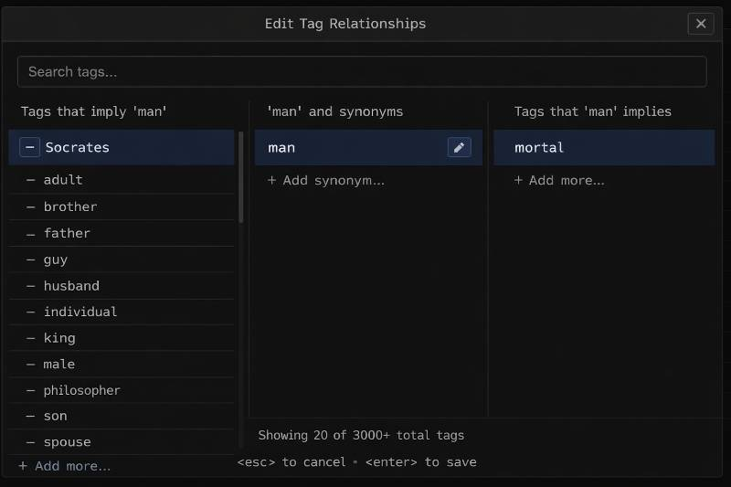

# Ontology Rules (v1)

Status: DB-backed (SQLite) and hot-editable via API/UI; rules are cached in memory.

## Scope

This document describes the ontology rule language currently implemented in:
- `app/services/tag_ontology.py`

Rules are stored in:
- SQLite `ontology_rules` table (loaded at startup into memory; edits update cache)

## Syntax

One rule per non-empty, non-comment line.

Operators:
- Implication: `LHS => RHS`
- Equality: `LHS = RHS` (syntactic sugar for `LHS => RHS` and `RHS => LHS`)

Comments:
- Blank lines are ignored
- Whole-line comments are ignored when they start with `#` or `//`
- Inline comments are not supported in v1

### Tags

- Tags are plain tokens (no special prefix required).
- `#` is allowed in tag tokens.
- Tags must be a single token with no spaces.
- Exact uppercase `OR` is reserved by search and is not a valid ontology tag;
  lowercase and mixed-case variants remain valid.

### LHS forms

LHS can be either:
- A single atom: `foo => bar`
- A conjunction group: `(atom atom atom) => bar`
  - Nested parentheses are not allowed in v1.

### Atoms

Allowed atoms on the LHS:

1) Tag atom

```
foo
```

2) Text atom (quoted)

```
"some phrase"
'some phrase'
```

3) Regex atom

```
/.../
/.../i
```

Regex notes:
- `/.../i` is case-insensitive.
- Escaping a literal slash inside the pattern uses `\/`.

## Semantics

Rules are applied per note as a monotone fixed point:
- Start with a set of tags.
- Repeatedly apply rules, only adding tags.
- Stop when no new tags are produced.

### Text atom semantics (word-boundary sugar)

Quoted text atoms are compiled as whole-word matches using `\b` boundaries.

- If the phrase is all-lowercase, it is treated as case-insensitive:
  - `"todo"` behaves like `/\btodo\b/i`
- Otherwise it is treated as case-sensitive:
  - `"TODO"` behaves like `/\bTODO\b/`
  - `"Todo"` behaves like `/\bTodo\b/`

This prevents accidental substring matches (e.g. `"TODO"` does not match `TODORS`).

## Testing

- Unit tests: `tests/unit/test_ontology_rules_store_sqlite.py`

## UI Interaction Spec (v1)

This section defines the initial UI interaction model for exploring and editing ontology rules.

### Concepts

- **Focus tag**: the tag currently centered in the UI.
- **Selected rule**: the rule currently shown in the center editor.

### Columns

- **Left column (incoming, direct-only)**
  - Direct tag implications: tags `A` where `A => focusTag`, excluding tags already in the focus SCC (synonyms).
  - Direct derivation rules: rules with `RHS == focusTag` where the LHS is not a single tag.
    - Display only the LHS expression (RHS is redundant with the current focus).
- **Center column (focus + editor)**
  - Default: focus tag view (including equal/SCC members).
  - When a rule is selected: show the full rule and editing controls.
  - Editing only happens in the center column.
- **Right column (outgoing, direct-only)**
  - Only direct tag implications: tags `B` where `focusTag => B`.
  - Rules never appear in the right column in v1.

### Click behavior

Rule rows in the left column are clickable as a whole:
- Clicking the row (background/parentheses/whitespace) selects the rule for editing in the center.

Tag atoms inside rule rows are styled as chips and are clickable:
- Clicking a tag chip changes the focus tag to that tag.
- Clicking a tag chip must not also select the rule.

Text/regex atoms are styled but not clickable.

Implementation note (DOM):
- Rule row has an onClick handler for selecting the rule.
- Tag chips have their own onClick handler and call `event.stopPropagation()` to prevent the row click.

### Tag search

- An empty search loads only the namespace-wide distinct-tag count; it does not materialize thousands of hidden suggestion rows. Typing opens a capped dropdown sorted by prefix, substring, fuzzy match, then frequency.
- The footer reports the distinct catalog size as **N total unique tags** (explicit note tags plus tags referenced by ontology rules) and does not claim that every catalog entry is visible.
- The dropdown is anchored to the search input, not the adjacent **Add new tag…** action, and keeps compact suggestion rows over the columns.
- While typing, results prioritize **prefix matches**, then substring matches, then fuzzy (subsequence) matches.
- Each suggestion shows a count badge with the number of notes containing that tag.
- Arrow keys move selection (first item is selected by default); `Enter` applies the selected suggestion, fills the input, and blurs the field.

### Relationship dialogs

- The add/edit dialogs for implications, synonyms, incoming conditions, and tags keep their visible submit button.
- **Add new tag…** presents only the tag input and actions; it omits redundant introductory copy and a redundant field label.
- Editing the focused tag supports both rename and **Delete tag…**. Deletion requires a separate confirmation, removes the exact tag token from every note tag bar, and deletes every ontology rule that references the tag. Quoted text and regular-expression matchers with the same characters are not tag references and remain intact.
- Suggestions open without an automatic selection; clicking a row selects it, and one `ArrowDown` selects the first row.
- Search and relationship-dialog inputs explicitly reset inherited modal margins, keeping suggestion panels directly below the field for incoming conditions, implications, synonyms, and edits.
- While a dialog input is focused, `Enter` performs the same submit action as that button when the user has not explicitly navigated to a suggestion.
- Arrow-key navigation marks the highlighted suggestion as explicit; the next `Enter` fills the input with that suggestion without submitting the relationship.
- Clicking a suggestion fills the input without submitting it and preserves that selection boundary for the next `Enter`.

### UI Mock


