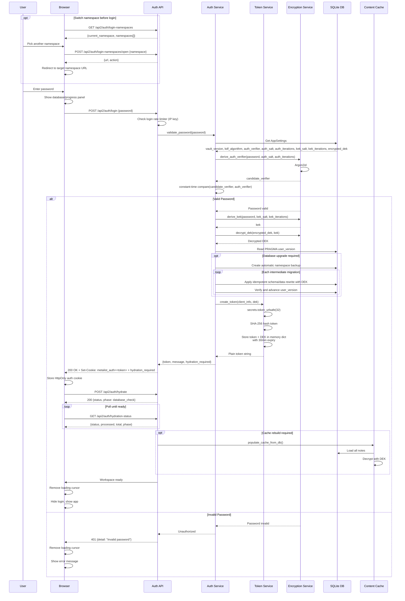

# Authentication & Encryption Flow

Complete authentication flow from password entry to cookie-backed session establishment with DEK decryption.

```mermaid
sequenceDiagram
    participant U as User
    participant Browser as Browser
    participant API as Auth API
    participant AuthSvc as Auth Service
    participant TokenSvc as Token Service
    participant Enc as Encryption Service
    participant DB as SQLite DB
    participant Cache as Content Cache

    opt Switch namespace before login
        Browser->>API: GET /api2/auth/login-namespaces
        API-->>Browser: {current_namespace, namespaces[]}
        U->>Browser: Pick another namespace
        Browser->>API: POST /api2/auth/login-namespaces/open {namespace}
        API-->>Browser: {url, action}
        Browser->>Browser: Redirect to target namespace URL
    end
    
    U->>Browser: Enter password
    Browser->>Browser: Show database/progress panel
    Browser->>API: POST /api2/auth/login {password}
    API->>API: Check login rate limiter (IP key)
    
    API->>AuthSvc: validate_password(password)
    AuthSvc->>DB: Get AppSettings
    DB-->>AuthSvc: vault_version, kdf_algorithm, auth_verifier, auth_salt, auth_iterations, kek_salt, kek_iterations, encrypted_dek
    
    AuthSvc->>Enc: derive_auth_verifier(password, auth_salt, auth_iterations)
    Enc->>Enc: Argon2id
    Enc-->>AuthSvc: candidate_verifier
    
    AuthSvc->>AuthSvc: constant-time compare(candidate_verifier, auth_verifier)
    
    alt Valid Password
        Enc-->>AuthSvc: Password valid
        AuthSvc->>Enc: derive_kek(password, kek_salt, kek_iterations)
        Enc-->>AuthSvc: kek
        AuthSvc->>Enc: decrypt_dek(encrypted_dek, kek)
        Enc-->>AuthSvc: Decrypted DEK

        AuthSvc->>DB: Read PRAGMA user_version
        opt Database upgrade required
            AuthSvc->>DB: Create automatic namespace backup
            loop Each intermediate migration
                AuthSvc->>DB: Apply idempotent schema/data rewrite with DEK
                AuthSvc->>DB: Verify and advance user_version
            end
        end
        
        AuthSvc->>TokenSvc: create_token(client_info, dek)
        TokenSvc->>TokenSvc: secrets.token_urlsafe(32)
        TokenSvc->>TokenSvc: SHA-256 hash token
        TokenSvc->>TokenSvc: Store token + DEK in memory dict<br/>with 30min expiry
        TokenSvc-->>AuthSvc: Plain token string
        
        AuthSvc-->>API: {token, message, hydration_required}
        API-->>Browser: 200 OK + Set-Cookie: metalist_auth=<token> + hydration_required
        Browser->>Browser: Store HttpOnly auth cookie
        Browser->>API: POST /api2/auth/hydrate
        API-->>Browser: 200 {status, phase: database_check}
        loop Poll until ready
            Browser->>API: GET /api2/auth/hydration-status
            API-->>Browser: {status, processed, total, phase}
        end
        opt Cache rebuild required
            API->>Cache: populate_cache_from_db()
            Cache->>DB: Load all notes
            Cache->>Cache: Decrypt with DEK
        end
        API->>Browser: Workspace ready
        Browser->>Browser: Remove loading cursor
        Browser->>Browser: Hide login, show app
    else Invalid Password
        Enc-->>AuthSvc: Password invalid
        AuthSvc-->>API: Unauthorized
        API-->>Browser: 401 {detail: "Invalid password"}
        Browser->>Browser: Remove loading cursor
        Browser->>Browser: Show error message
    end
```
