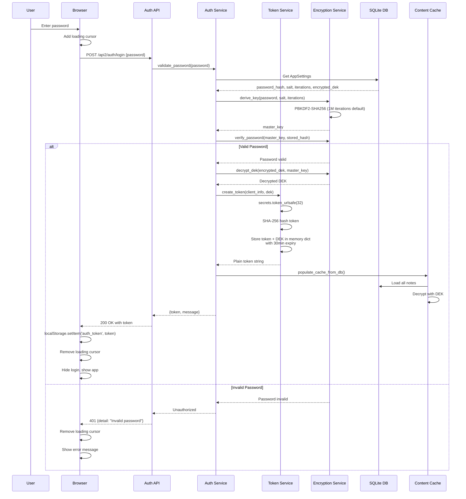

# Authentication & Encryption Flow

Complete authentication flow from password entry to token storage with DEK decryption.

```mermaid
sequenceDiagram
    participant U as User
    participant Browser as Browser
    participant API as Auth API
    participant AuthSvc as Auth Service
    participant TokenSvc as Token Service
    participant Enc as Encryption Service
    participant DB as SQLite DB
    participant Cache as Content Cache
    
    U->>Browser: Enter password
    Browser->>Browser: Add loading cursor
    Browser->>API: POST /api2/auth/login {password}
    
    API->>AuthSvc: validate_password(password)
    AuthSvc->>DB: Get AppSettings
    DB-->>AuthSvc: password_hash, salt, iterations, encrypted_dek
    
    AuthSvc->>Enc: derive_key(password, salt, iterations)
    Enc->>Enc: PBKDF2-SHA256 (1M iterations default)
    Enc-->>AuthSvc: master_key
    
    AuthSvc->>Enc: verify_password(master_key, stored_hash)
    
    alt Valid Password
        Enc-->>AuthSvc: Password valid
        AuthSvc->>Enc: decrypt_dek(encrypted_dek, master_key)
        Enc-->>AuthSvc: Decrypted DEK
        
        AuthSvc->>TokenSvc: create_token(client_info, dek)
        TokenSvc->>TokenSvc: secrets.token_urlsafe(32)
        TokenSvc->>TokenSvc: SHA-256 hash token
        TokenSvc->>TokenSvc: Store token + DEK in memory dict<br/>with 30min expiry
        TokenSvc-->>AuthSvc: Plain token string
        
        AuthSvc->>Cache: populate_cache_from_db()
        Cache->>DB: Load all notes
        Cache->>Cache: Decrypt with DEK
        
        AuthSvc-->>API: {token, message}
        API-->>Browser: 200 OK with token
        Browser->>Browser: localStorage.setItem('auth_token', token)
        Browser->>Browser: Remove loading cursor
        Browser->>Browser: Hide login, show app
    else Invalid Password
        Enc-->>AuthSvc: Password invalid
        AuthSvc-->>API: Unauthorized
        API-->>Browser: 401 {detail: "Invalid password"}
        Browser->>Browser: Remove loading cursor
        Browser->>Browser: Show error message
    end
```
