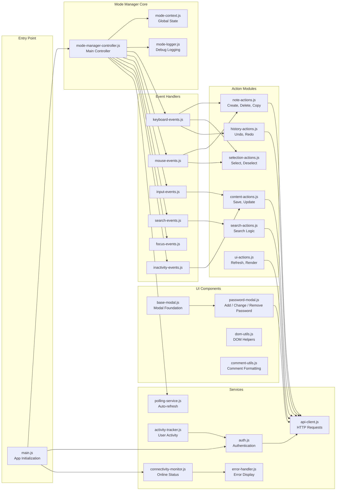

# Component Architecture

Frontend JavaScript module organization showing the actual file structure and relationships.

```mermaid
graph LR
    subgraph "Entry Point"
        Main[main.js<br/>App Initialization]
    end
    
    subgraph "UI Components"
        BaseModal[base-modal.js<br/>Modal Foundation]
        PasswordModals[password-modal.js<br/>Add / Change / Remove Password]
        DOMUtils[dom-utils.js<br/>DOM Helpers]
        CommentUtils[comment-utils.js<br/>Comment Formatting]
    end
    
    subgraph "Mode Manager Core"
        Controller[mode-manager-controller.js<br/>Main Controller]
        Context[mode-context.js<br/>Global State]
        Logger[mode-logger.js<br/>Debug Logging]
    end
    
    subgraph "Event Handlers"
        Keyboard[keyboard-events.js]
        Mouse[mouse-events.js]
        Input[input-events.js]
        Search[search-events.js]
        Focus[focus-events.js]
        Inactivity[inactivity-events.js]
    end
    
    subgraph "Action Modules"
        NoteAct[note-actions.js<br/>Create, Delete, Copy]
        ContentAct[content-actions.js<br/>Save, Update]
        SelectionAct[selection-actions.js<br/>Select, Deselect]
        SearchAct[search-actions.js<br/>Search Logic]
        HistoryAct[history-actions.js<br/>Undo, Redo]
        UIAct[ui-actions.js<br/>Refresh, Render]
    end
    
    subgraph "Services"
        APIClient[api-client.js<br/>HTTP Requests]
        Auth[auth.js<br/>Authentication]
        ConnMonitor[connectivity-monitor.js<br/>Online Status]
        ActivityTracker[activity-tracker.js<br/>User Activity]
        PollingService[polling-service.js<br/>Auto-refresh]
        ErrorHandler[error-handler.js<br/>Error Display]
    end
    
    Main --> Controller
    Main --> Auth
    Main --> ConnMonitor
    
    Controller --> Context
    Controller --> Logger
    Controller --> Keyboard
    Controller --> Mouse
    Controller --> Input
    Controller --> Search
    Controller --> Focus
    Controller --> Inactivity
    Controller --> PollingService
    
    Keyboard --> NoteAct
    Keyboard --> SelectionAct
    Keyboard --> HistoryAct
    Mouse --> NoteAct
    Mouse --> SelectionAct
    Input --> ContentAct
    Search --> SearchAct
    Inactivity --> ContentAct
    
    NoteAct --> APIClient
    ContentAct --> APIClient
    SearchAct --> APIClient
    HistoryAct --> APIClient
    UIAct --> APIClient
    
    Auth --> APIClient
    ConnMonitor --> ErrorHandler
    ActivityTracker --> Auth
    
    BaseModal --> PasswordModals
    PasswordModals --> APIClient
```
