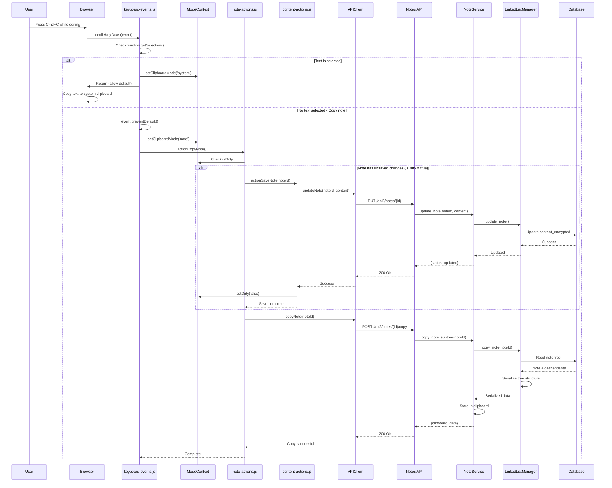

# Copy Note Flow

Complete flow showing the fix where dirty notes are saved before copying to ensure current edits are included.

```mermaid
sequenceDiagram
    participant U as User
    participant Browser as Browser
    participant Keyboard as keyboard-events.js
    participant Context as ModeContext
    participant Actions as note-actions.js
    participant Content as content-actions.js
    participant API as APIClient
    participant Server as Notes API
    participant Service as NoteService
    participant LLM as LinkedListManager
    participant DB as Database
    
    U->>Browser: Press Cmd+C while editing
    Browser->>Keyboard: handleKeyDown(event)
    Keyboard->>Keyboard: Check window.getSelection()
    
    alt Text is selected
        Keyboard->>Context: setClipboardMode('system')
        Keyboard->>Browser: Return (allow default)
        Browser->>Browser: Copy text to system clipboard
    else No text selected - Copy note
        Keyboard->>Keyboard: event.preventDefault()
        Keyboard->>Context: setClipboardMode('note')
        Keyboard->>Actions: actionCopyNote()
        
        Actions->>Context: Check isDirty
        alt Note has unsaved changes (isDirty = true)
            Actions->>Content: actionSaveNote(noteId)
            Content->>API: updateNote(noteId, content)
            API->>Server: PUT /api2/notes/{id}
            Server->>Service: update_note(noteId, content)
            Service->>LLM: update_note()
            LLM->>DB: Update content_encrypted
            DB-->>LLM: Success
            LLM-->>Service: Updated
            Service-->>Server: {status: updated}
            Server-->>API: 200 OK
            API-->>Content: Success
            Content->>Context: setDirty(false)
            Content-->>Actions: Save complete
        end
        
        Actions->>API: copyNote(noteId)
        API->>Server: POST /api2/notes/{id}/copy
        Server->>Service: copy_note_subtree(noteId)
        Service->>LLM: copy_note(noteId)
        LLM->>DB: Read note tree
        DB-->>LLM: Note + descendants
        LLM->>LLM: Serialize tree structure
        LLM-->>Service: Serialized data
        Service->>Service: Store in clipboard
        Service-->>Server: {clipboard_data}
        Server-->>API: 200 OK
        API-->>Actions: Copy successful
        Actions-->>Keyboard: Complete
    end
```
