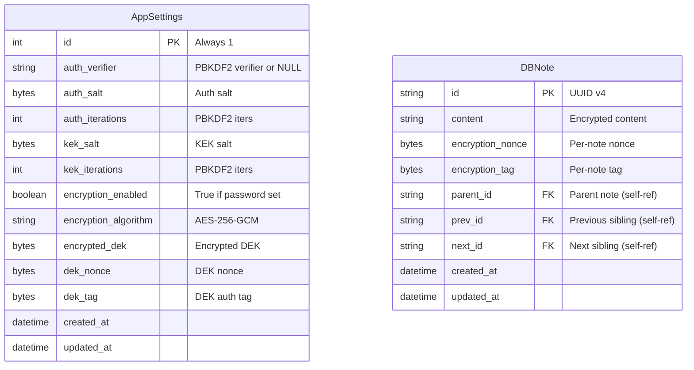

# Database Schema

SQLite database structure with two tables: AppSettings (singleton) and DBNote (hierarchical linked list).

```mermaid
erDiagram
    AppSettings {
        int id PK "Always 1"
        string auth_verifier "PBKDF2 verifier or NULL"
        bytes auth_salt "Auth salt"
        int auth_iterations "PBKDF2 iters"
        bytes kek_salt "KEK salt"
        int kek_iterations "PBKDF2 iters"
        boolean encryption_enabled "True if password set"
        string encryption_algorithm "AES-256-GCM"
        bytes encrypted_dek "Encrypted DEK"
        bytes dek_nonce "DEK nonce"
        bytes dek_tag "DEK auth tag"
        datetime created_at
        datetime updated_at
    }
    
    DBNote {
        string id PK "UUID v4"
        string content "Encrypted content"
        bytes encryption_nonce "Per-note nonce"
        bytes encryption_tag "Per-note tag"
        string parent_id FK "Parent note (self-ref)"
        string prev_id FK "Previous sibling (self-ref)"
        string next_id FK "Next sibling (self-ref)"
        datetime created_at
        datetime updated_at
    }
```
