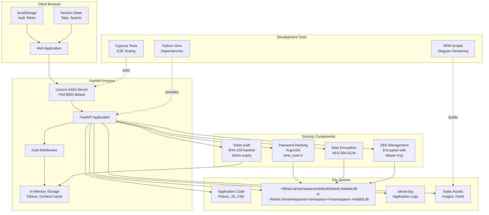

# Deployment Architecture

Production deployment structure showing processes, storage, and security components.

```mermaid
graph TB
    subgraph "Client Browser"
        WebApp[Web Application]
        LocalStorage[localStorage<br/>Auth Token]
        SessionStorage[Session State<br/>Tabs, Search]
    end
    
    subgraph "FastAPI Process"
        ASGI[Uvicorn ASGI Server<br/>Port 8000 default]
        App[FastAPI Application]
        Middleware[Auth Middleware]
        InMemory[In-Memory Storage<br/>Tokens, Content Cache]
    end
    
    subgraph "File System"
        AppCode[Application Code<br/>Python, JS, CSS]
        SQLiteFile[~/MetaList/namespaces/default/default.metalist.db<br/>or ~/MetaList/namespaces/&lt;namespace&gt;/&lt;namespace&gt;.metalist.db]
        Logs[server.log<br/>Application Logs]
        StaticAssets[Static Assets<br/>Images, Fonts]
    end
    
    subgraph "Security Components"
        PassHash[Password Hashing<br/>Argon2id<br/>time_cost=3]
        DataEnc[Data Encryption<br/>AES-256-GCM]
        TokenAuth[Token Auth<br/>SHA-256 hashed<br/>30min expiry]
        DEKMgmt[DEK Management<br/>Encrypted with<br/>Master Key]
    end
    
    subgraph "Development Tools"
        Cypress[Cypress Tests<br/>E2E Testing]
        NPM[NPM Scripts<br/>Diagram Rendering]
        Venv[Python Venv<br/>Dependencies]
    end
    
    WebApp --> ASGI
    LocalStorage --> WebApp
    SessionStorage --> WebApp
    
    ASGI --> App
    App --> Middleware
    Middleware --> InMemory
    
    App --> AppCode
    App --> SQLiteFile
    App --> Logs
    App --> StaticAssets
    
    App --> PassHash
    App --> DataEnc
    App --> TokenAuth
    App --> DEKMgmt
    
    PassHash --> SQLiteFile
    DataEnc --> SQLiteFile
    TokenAuth --> InMemory
    DEKMgmt --> SQLiteFile
    
    Cypress -.->|tests| ASGI
    NPM -.->|builds| StaticAssets
    Venv -.->|provides| App
```
