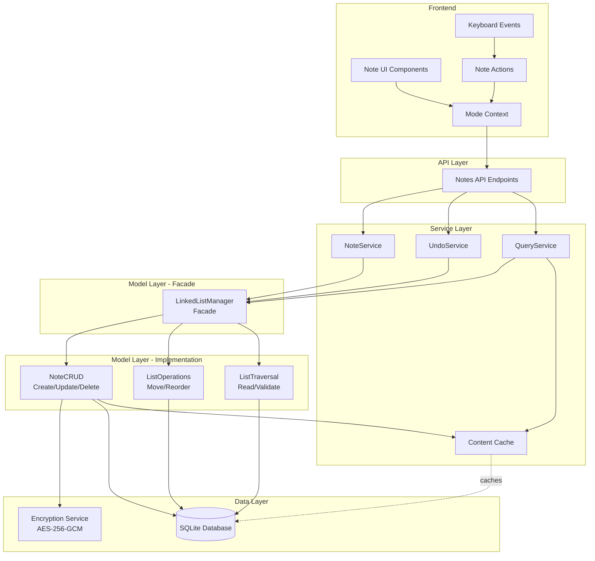

# Note Management System

Architecture of the hierarchical note system showing the actual layered implementation.

```mermaid
graph TD
    subgraph "Frontend"
        NoteUI[Note UI Components]
        ModeCtx[Mode Context]
        NoteActions[Note Actions]
        KeyboardEvents[Keyboard Events]
    end
    
    subgraph "API Layer"
        NotesAPI[Notes API Endpoints]
    end
    
    subgraph "Service Layer"
        NotesService[NoteService]
        UndoService[UndoService]
        QueryService[QueryService]
        ContentCache[Content Cache]
    end
    
    subgraph "Model Layer - Facade"
        LinkedListManager[LinkedListManager<br/>Facade]
    end
    
    subgraph "Model Layer - Implementation"
        NoteCRUD[NoteCRUD<br/>Create/Update/Delete]
        ListOps[ListOperations<br/>Move/Reorder]
        ListTrav[ListTraversal<br/>Read/Validate]
    end
    
    subgraph "Data Layer"
        Encryption[Encryption Service<br/>AES-256-GCM]
        DB[(SQLite Database)]
    end
    
    NoteUI --> ModeCtx
    KeyboardEvents --> NoteActions
    NoteActions --> ModeCtx
    ModeCtx --> NotesAPI
    
    NotesAPI --> NotesService
    NotesAPI --> UndoService
    NotesAPI --> QueryService
    
    NotesService --> LinkedListManager
    UndoService --> LinkedListManager
    QueryService --> LinkedListManager
    QueryService --> ContentCache
    
    LinkedListManager --> NoteCRUD
    LinkedListManager --> ListOps
    LinkedListManager --> ListTrav
    
    NoteCRUD --> Encryption
    NoteCRUD --> DB
    NoteCRUD --> ContentCache
    ListOps --> DB
    ListTrav --> DB
    
    ContentCache -.->|caches| DB
```