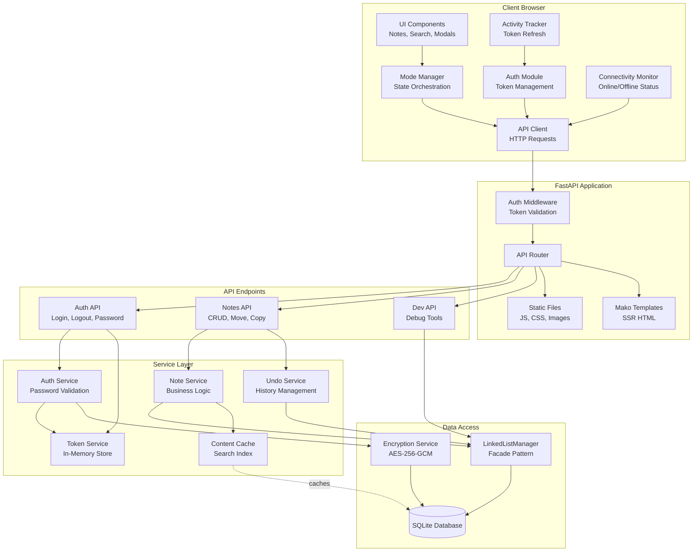

# System Architecture

High-level overview of MetaList3 system components and their relationships.

```mermaid
graph TB
    subgraph "Client Browser"
        UI[UI Components<br/>Notes, Search, Modals]
        MM[Mode Manager<br/>State Orchestration]
        AC[API Client<br/>HTTP Requests]
        Auth[Auth Module<br/>Token Management]
        CM[Connectivity Monitor<br/>Online/Offline Status]
        AT[Activity Tracker<br/>Token Refresh]
    end
    
    subgraph "FastAPI Application"
        MW[Auth Middleware<br/>Token Validation]
        Router[API Router]
        Static[Static Files<br/>JS, CSS, Images]
        Templates[Mako Templates<br/>SSR HTML]
    end
    
    subgraph "API Endpoints"
        AuthAPI[Auth API<br/>Login, Logout, Password]
        NotesAPI[Notes API<br/>CRUD, Move, Copy]
        DevAPI[Dev API<br/>Debug Tools]
    end
    
    subgraph "Service Layer"
        AuthService[Auth Service<br/>Password Validation]
        TokenService[Token Service<br/>In-Memory Store]
        NoteService[Note Service<br/>Business Logic]
        UndoService[Undo Service<br/>History Management]
        ContentCache[Content Cache<br/>Search Index]
    end
    
    subgraph "Data Access"
        LinkedList[LinkedListManager<br/>Facade Pattern]
        Encryption[Encryption Service<br/>AES-256-GCM]
        DB[(SQLite Database)]
    end
    
    UI --> MM
    MM --> AC
    AC --> MW
    Auth --> AC
    CM --> AC
    AT --> Auth
    
    MW --> Router
    Router --> AuthAPI
    Router --> NotesAPI
    Router --> DevAPI
    Router --> Static
    Router --> Templates
    
    AuthAPI --> AuthService
    AuthAPI --> TokenService
    NotesAPI --> NoteService
    NotesAPI --> UndoService
    DevAPI --> LinkedList
    
    AuthService --> TokenService
    AuthService --> Encryption
    NoteService --> LinkedList
    NoteService --> ContentCache
    UndoService --> LinkedList
    
    LinkedList --> DB
    Encryption --> DB
    ContentCache -.->|caches| DB
```